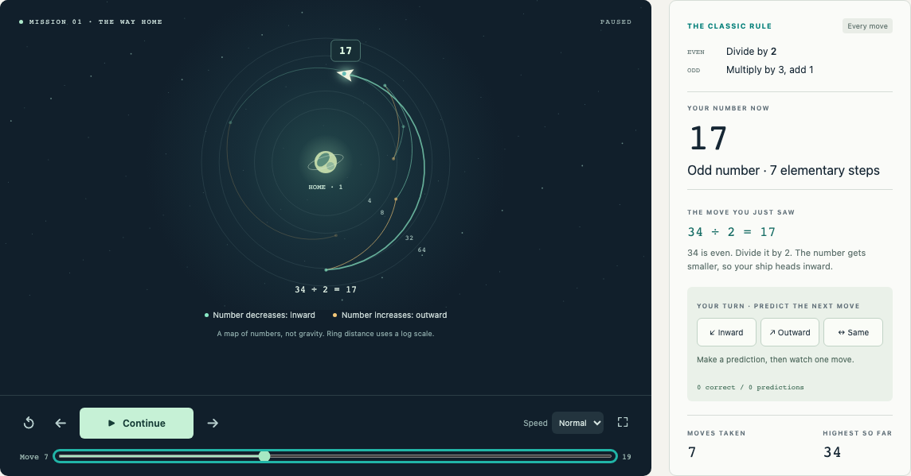

# Orbit Mission

A playable introduction to integer recurrences. Pick a starting number, press
**Play**, and watch each arithmetic operation move a ship. Step through the route,
predict whether the next move goes inward, outward, or stays at the same distance,
try another rule, and compare recorded experiments.



The space setting is a metaphor. The ship represents a number, and its journey
represents repeated calculations. This is not a simulation of gravity, galaxies,
energy, or any other physical system. Its practical purpose is to help people
learn how rules produce loops, how small rule changes affect behaviour, and how
to record experiments that someone else can repeat.

## Run locally

From the repository root, with Python 3 installed:

```sh
python3 orbit-mission/serve.py --port 8767
```

Open <http://127.0.0.1:8767>. No installation, account, backend, or API key is
required. The local server provides build metadata from the current checkout for
saved experiments. Stop the server with Ctrl+C.

A plain static server also runs the game, but cannot supply the checkout's dynamic
build metadata:

```sh
python3 -m http.server 8767 --bind 127.0.0.1 --directory orbit-mission
```

Serve the files over HTTP; opening the HTML directly as a `file:` URL can prevent
JavaScript modules from loading.

Run the arithmetic and history checks with a recent Node.js version:

```sh
node --test orbit-mission/tests/*.test.mjs
```

The optional browser regression suite requires Playwright and its Chromium browser
installed in your development environment. With the local server running:

```sh
node orbit-mission/tests/browser-smoke.mjs
node orbit-mission/tests/history-browser-smoke.mjs
```

Set `PLAYWRIGHT_MODULE` to an installed Playwright module path if it is not on
Node's normal search path. `BASE_URL` overrides the server URL and `QA_OUTPUT_DIR`
overrides the screenshot/report output directory (the system temporary directory
by default). Tests use an isolated browser context; they do not read or modify
your normal browser's saved flights.

## What the mathematics means

The classic rule takes a positive integer `n`:

- If `n` is even, the next number is `n / 2`.
- If `n` is odd, the next number is `3n + 1`.

For example, `3 → 10 → 5 → 16 → 8 → 4 → 2 → 1`. Each arrow is a
standard step. The game calls reaching 1 **home** and stops there. Continuing the
classic recurrence would repeat `1 → 4 → 2 → 1`.

The repository mainly studies the **accelerated odd map**: after an odd move,
divide out every factor of 2 to reach the next odd number. In that convention,
the same start gives `3 → 5 → 1`. An accelerated step can contain several
standard steps, so step counts and visible peaks must be read with the selected
mode in mind. The app requires an odd starting number in **Odd numbers only**
mode; choose **Every move** to start with an even number.

The rule selector also offers `3n − 1` and `5n + 1` for the odd branch. The
custom rule controls accept an odd multiplier from 1 to 9 and an odd offset from
−9 to 9. All keep division by 2 as the even branch. For example, changing the
classic odd branch to `3n − 1` sends 5 into `5 → 14 → 7 → 20 → 10 → 5`.

These experimental recurrences change the problem being studied. Reaching home
more quickly under a different rule does not improve or prove the Collatz
conjecture. The selected stop-at-1 convention also applies to these variants;
it is a game target, not a claim that 1 is a fixed point of every rule.

The important distinction behind the repository's affine correction is that
repeated `+1` operations accumulate. Multiplying the starting number by the
combined scale factors alone does not reproduce the trajectory. For example,
the classic accelerated route `9 → 7 → 11 → 17` ends at 17. Multiplication
alone gives `243 / 16 = 15.1875`; accumulated additions supply the remaining
`29 / 16 = 1.8125`.

## Read the outcome correctly

- **Home:** this particular run reached 1.
- **Cycle:** the run repeated a value before reaching home. Under a deterministic
  rule, repeating a value repeats the subsequent route.
- **Limit:** an explicit computation limit stopped the run. Its eventual outcome
  is unknown; a limit is not evidence of divergence.
- **Invalid:** the next calculation would leave the positive integers, so that
  move was not taken. Invalid starting configurations are rejected before launch.

The workshop uses a limit of 600 displayed moves and a maximum integer size of
4,096 bits. The engine also accepts replay configurations with a step limit
between 1 and 1,000. In odd mode the size check includes the result of the odd
operation before its factors of 2 are removed. The starting input supports up
to 60 decimal digits. These bounds keep experiments finite; they are not
mathematical conclusions about the recurrence.

Integer calculations use JavaScript `BigInt`. Canvas position, animation, and
display scales are approximate visual encodings; they do not determine the
arithmetic. Every completed run is evidence about that input and rule only.
Neither an animation nor a large collection of successful runs proves that
every positive integer reaches 1.

## Experiment history and research history

Use **Save flight & compare** during a journey, or **Save this flight** at the
finish, to record an experiment in the Flight log. Saving is manual. The complete
bounded calculation is recorded even if you save before playback has finished.
Select up to three recorded flights for comparison or replay one to watch it
again.

Saved runs belong to this browser's local storage. They are not uploaded,
published to GitHub, or shared across devices. Clearing browser data can remove
them. Replay uses a recorded rule and starting number; comparison concerns those
recorded runs, not model rankings or universal performance.

**Project history** lists the 10 most recently updated pull requests from the
public GitHub API. Opening the tab checks for updates, at most once per minute;
**Refresh from GitHub** checks immediately. Each entry links to its PR and labels
it as open, draft, merged, or closed. An open, non-draft PR is ready for review;
that label does not mean a reviewer has been assigned or has approved it.

The list shows when it last checked successfully. While loading, or if GitHub is
unreachable or rate-limited, it retains the last successful result or the dated
checked-in fallback in `pull-request-snapshot.mjs`. A failed refresh is shown
explicitly; fallback data is not presented as current. The request sends no
credentials or saved flight data and needs no API key. The game and local flight
log do not depend on GitHub being available. Browser regression tests mock the
API so they remain deterministic and do not consume GitHub's request allowance.

The separate research milestones in `provenance.mjs` remain a curated snapshot
of actual repository commits. Each entry links to the source commit or pull
request. Author names and titles preserve git metadata.
A model name in that metadata records attribution supplied by the repository;
it does not establish which model produced every line, or independently validate
a research claim. Consult the root [`CLAIM_LEDGER.md`](../CLAIM_LEDGER.md) for
the repository's current claim statuses.

`PROVENANCE.sourceRevision` identifies the research baseline
`fee9b8e613c05d5a35aebab757abc5c9e1d80a16`, which merged correction PR #4.
It is deliberately separate from the app release identifier,
`PROVENANCE.appVersion` (`0.1.1`). The research baseline is not a claim that the
app's source code existed at that commit.

The preferred server's `build.json` reports the checkout's actual Git HEAD and
SHA-256 fingerprints of `app.mjs` and `engine.mjs`. Replay metadata uses that
actual revision when available; the application version remains a separate
release label. A commit identifies committed source, while fingerprints can
distinguish the served files when local edits exist. Neither field is an
authenticated claim of authorship. A static server cannot discover Git HEAD;
do not substitute the research baseline for an unknown app revision.

Use **Export verified replay** to keep a JSON copy and **Import replay** in the
Flight log to check one. Replays contain decimal strings for exact integers,
rule parameters, the step convention and limit, every displayed frame, and the
outcome, alongside engine and provenance metadata. The verifier recomputes the
run and checks its arithmetic, frames, and outcome before accepting it. This
does not authenticate the supplied timestamps, authorship, or provenance label.
JSON import/export and replay are client-side features, not a cryptographic
certificate or a permanent contribution archive.

## Moving the product forward

The useful next step is to make explanations and saved experiments reproducible:
teach one operation at a time, expose a clear stopping reason, and let another
person replay the same rule. Research-grade certificates, verified theorem
links, and a versioned shared experiment library can build on that foundation.
New rules and visual styles should preserve the distinction between an exact
calculation, a finite observation, and an unresolved mathematical claim.
